<div align="center">

  

  <h3>The AI-Augmented, Safety-First Urban Mobility & Navigation Companion</h3>

  <p align="center">
    <b>Empowering Safe, Confident Journeys Through Predictive Safety Routing, Offline Resilience & Real-Time Situational AI.</b>
  </p>

  <p align="center">
    <a href="#key-features"></a>
    <a href="#system-architecture"></a>
    <a href="#technical-stack"></a>
    <a href="#quality-assurance--testing"></a>
    <a href="#release-binary"></a>
    <a href="#license"></a>
  </p>

  <p align="center">
    <a href="#problem-statement">Problem Statement</a> •
    <a href="#core-innovations">Core Innovations</a> •
    <a href="#app-tour--ui-showcase">UI Showcase</a> •
    <a href="#system-architecture">Architecture</a> •
    <a href="#fit-score-algorithm">Fit Score™ Algorithm</a> •
    <a href="#offline-mesh--low-signal-mode">Offline Mode</a> •
    <a href="#installation--setup">Setup & Run</a>
  </p>

</div>

---

## 📌 Executive Summary

Modern urban transit applications (Google Maps, Apple Maps, etc.) are fundamentally engineered around a single optimization function: **finding the mathematically shortest or fastest route**. For late-night commuters, women, students, and vulnerable pedestrians, speed is secondary to **personal safety**. Conventional algorithms routinely steer users through unlit alleyways, desolate industrial corridors, or high-risk blind spots simply because they shave off 90 seconds.

**Saahat (साहत / राहत)** redefines urban navigation from the ground up by introducing a **safety-first, context-aware routing paradigm**. By synthesizing real-time high-mast lighting data, pedestrian footfall, police and hospital radii, active storefront density, and crowdsourced community intel, Saahat generates a multi-variable **Fit Score™** for every path. 

Paired with **Saarthi™** (an in-journey situational AI companion) and an **uncompromising Low-Signal Mode** that works 100% offline during network dead zones, Saahat acts as an intelligent digital guardian for every step of the journey.

---

## 🚨 Problem Statement & Market Gap

| The Traditional Navigation Gap | The Saahat Safety Paradigm |
| :--- | :--- |
| **Shortest-Path Fallacy:** Dijkstra & A* routing minimize travel time ($t$), routing pedestrians through pitch-black, deserted alleys. | **Multi-Factor Fit Score™:** Evaluates street-lighting, footfall, emergency service proximity, and active storefronts alongside transit time. |
| **Network Dependency Failure:** Modern apps go blank when mobile connectivity drops in basements, transit tunnels, or suburban dead zones. | **Zero-Internet Low Signal Mode:** Complete offline route geometry, step-by-step guidance, help-point caches, and local check-in ledgers. |
| **Generic Chatbots:** Standard conversational AI lacks live spatial coordinates, segment hazards, and local safety POIs. | **Saarthi Situational AI:** LLM injected with dynamic route telemetry, safety segment context, and nearby emergency shelters. |
| **Passive Panics:** Emergency apps require complex multi-step navigation when a user is already terrified or incapacitated. | **Zero-Friction SOS Grid:** 5-second cancelable countdown, instant multi-recipient SMS with live Google Maps GPS pins, strobe beacon, and siren. |

---

## 🌟 Core Innovations

### 1. 🛡️ Proprietary Fit Score™ Safety Routing Engine
Every route is evaluated against dynamic spatial metrics and assigned a granular safety rating from **1.0 to 10.0**:
- **Lighting Quality Index (30%):** High-mast LED coverage, pole density, and historical illumination records.
- **Pedestrian Footfall & Commercial Activity (25%):** Density of 24/7 commercial storefronts, open pharmacies, and active transit hubs.
- **Emergency Service Proximity (25%):** Proximity radius to active police stations, PCR patrol checkpoints, and 24/7 hospitals.
- **Transit Corridor Connectivity (20%):** Shelter coverage, metro station entrances, and active bus routes.
- **Time-of-Day Adaptation:** Dynamically re-weights risks for Day vs. After-Hours/Night travel.

### 2. 🤖 Saarthi™: The Situational AI Journey Guide
- Integrated with state-of-the-art LLM architectures (OpenAI `gpt-4o-mini` / Anthropic).
- Automatically injected with **situational context**: the user's active route, lighting score, transit mode, low-signal state, and nearby safety facilities.
- Accessible via a persistent non-intrusive floating button and directly inside turn-by-turn navigation for instant hands-free guidance.

### 3. 📡 Low-Signal & Zero-Data Mode (Offline Resilience)
- Designed for cellular blackouts, low-battery emergencies, or rural transit.
- High-contrast OLED dark theme minimizes device power draw while maximizing legibility.
- **Offline Route Downloader:** Saves route geometry, turn-by-turn maneuvers, static map snapshots, and emergency help points to local storage (`shared_preferences` + local cache).
- **Offline Check-In Ledger:** Enables commuters to record timestamps and coordinates locally without internet access.

### 4. 🚨 One-Tap Emergency SOS Grid
- Immediate single-tap trigger from any screen in the app.
- **5-Second Cancelable Failsafe:** High-visibility countdown timer allows users to cancel accidental triggers.
- **Automated GPS SMS Dispatch:** Automatically opens native telephony intent to blast emergency contacts with real-time latitude/longitude links.
- **Hardware Strobe & Siren:** Blinks camera LED strobe at emergency distress frequencies while sounding a high-decibel alert.
- **Direct Speed-Dial:** One-tap triggers to **112** (National Emergency), **1091** (Women Helpline), and **100** (Police).

### 5. 👥 Crowdsourced Community Safety Notes
- Anonymous, verified geo-tagged community reports.
- Categorized feeds: **Streetlights**, **Footfall**, **Transit & Stations**, and **General Safety**.
- Image attachments via camera or gallery with instant local persistence.
- Verified badges for vetted community observations.

### 6. 🗺️ Live Turn-by-Turn Safe Navigation
- Full vector & raster map rendering using Geoapify OSM-bright tiles.
- Dynamic route polyline tracing, safety POI markers, and live GPS location marker with radar pulse animation and compass heading rotation.
- Real-time maneuver banner, Saarthi voice guidance prompt with mute toggle, and an **"Arrived Safely"** celebration check-in modal.

---

## 📱 App Tour & UI Showcase

<div align="center">
  <table>
    <tr>
      <td width="33%" align="center">
        <b>1. Safe Mobility Home</b><br/>
        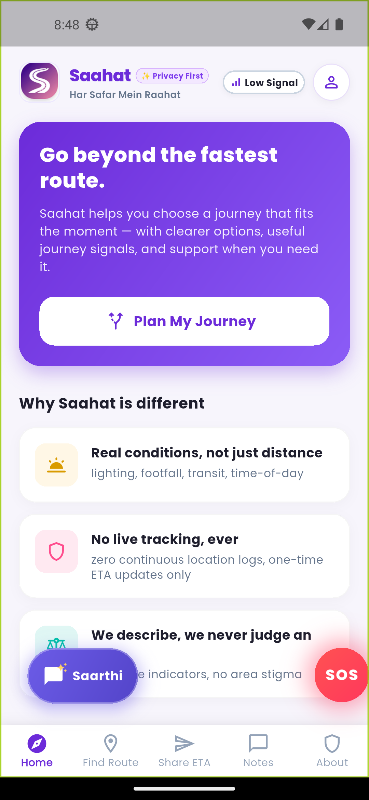<br/>
        <sub>Interactive dashboard with quick actions, safety metrics & journey planner.</sub>
      </td>
      <td width="33%" align="center">
        <b>2. Safe Route Finder</b><br/>
        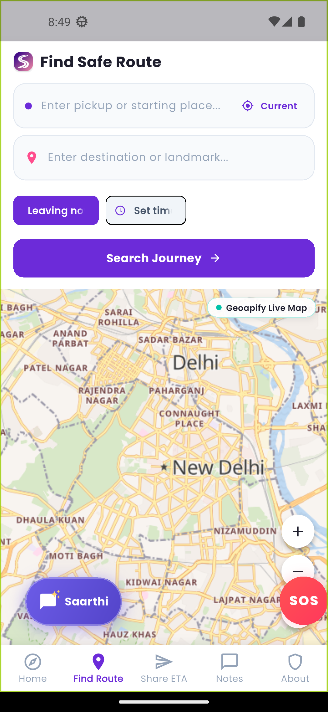<br/>
        <sub>Autocomplete geocoding, GPS location detect & interactive tile map.</sub>
      </td>
      <td width="33%" align="center">
        <b>3. Route Results & Fit Score</b><br/>
        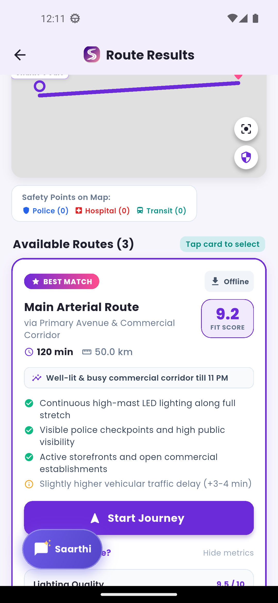<br/>
        <sub>Fit Score breakdown, pros & cons safety audit, and Start Journey button.</sub>
      </td>
    </tr>
    <tr>
      <td width="33%" align="center">
        <b>4. Live Turn-by-Turn Nav</b><br/>
        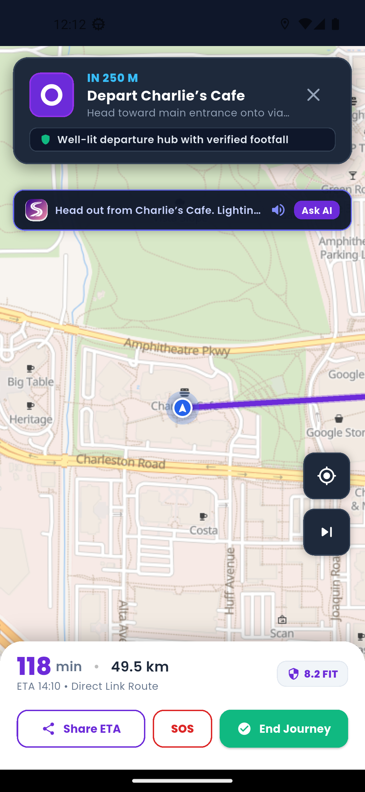<br/>
        <sub>Live GPS radar, route polyline, turn maneuvers & Saarthi voice guidance.</sub>
      </td>
      <td width="33%" align="center">
        <b>5. Saarthi AI Assistant</b><br/>
        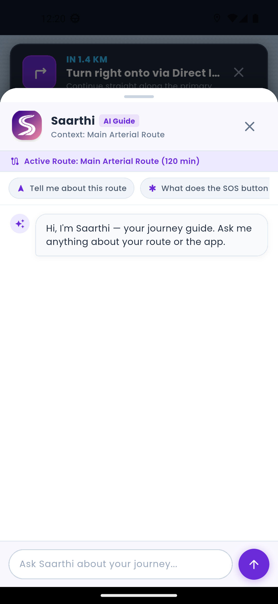<br/>
        <sub>Context-aware conversational guidance with active route intelligence.</sub>
      </td>
      <td width="33%" align="center">
        <b>6. Zero-Data Low Signal Mode</b><br/>
        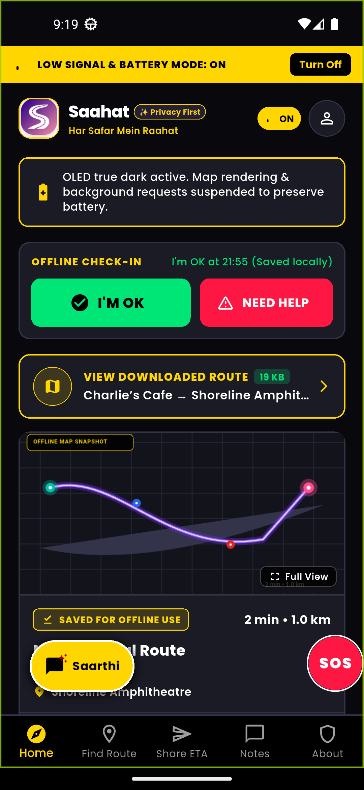<br/>
        <sub>High-contrast OLED theme, cached route viewer & zero-data resilience.</sub>
      </td>
    </tr>
    <tr>
      <td width="33%" align="center">
        <b>7. Emergency SOS Grid</b><br/>
        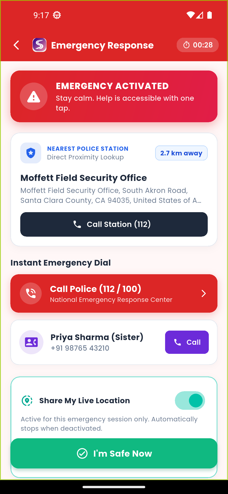<br/>
        <sub>5s countdown, hardware strobe beacon, siren & instant GPS SMS dispatch.</sub>
      </td>
      <td width="33%" align="center">
        <b>8. Native Share ETA</b><br/>
        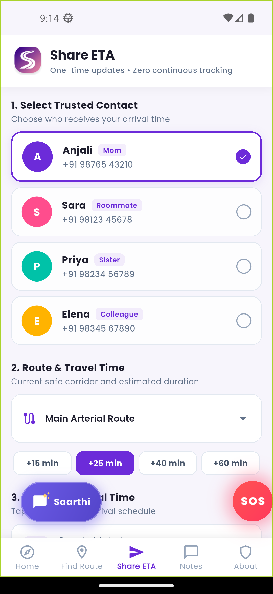<br/>
        <sub>Pre-filled SMS intent to trusted contacts with live route & arrival time.</sub>
      </td>
      <td width="33%" align="center">
        <b>9. Community Safety Notes</b><br/>
        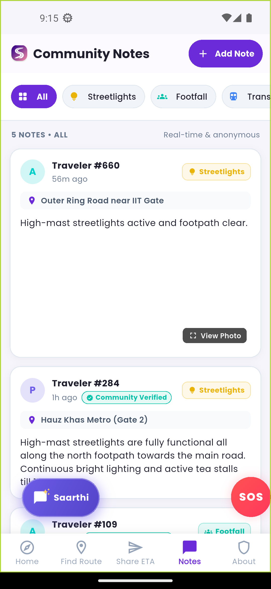<br/>
        <sub>Anonymous crowdsourced hazard reports with categories & photo verification.</sub>
      </td>
    </tr>
  </table>
  <br/>
  <table width="60%">
    <tr>
      <td align="center">
        <b>10. "You've Arrived Safely!" Check-in</b><br/>
        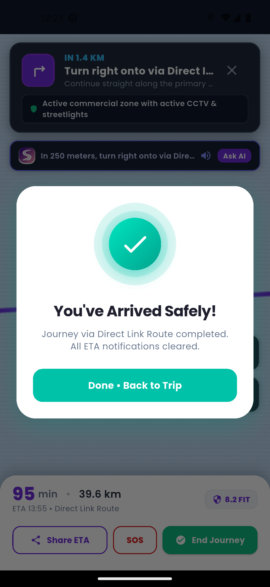<br/>
        <sub>Automated safe arrival confirmation and notification clearing.</sub>
      </td>
    </tr>
  </table>
</div>

---

## 📐 System Architecture

Saahat is engineered with clean architectural separation, combining reactive state management, asynchronous native device bridges, and cloud-resilient fail-soft fallbacks:

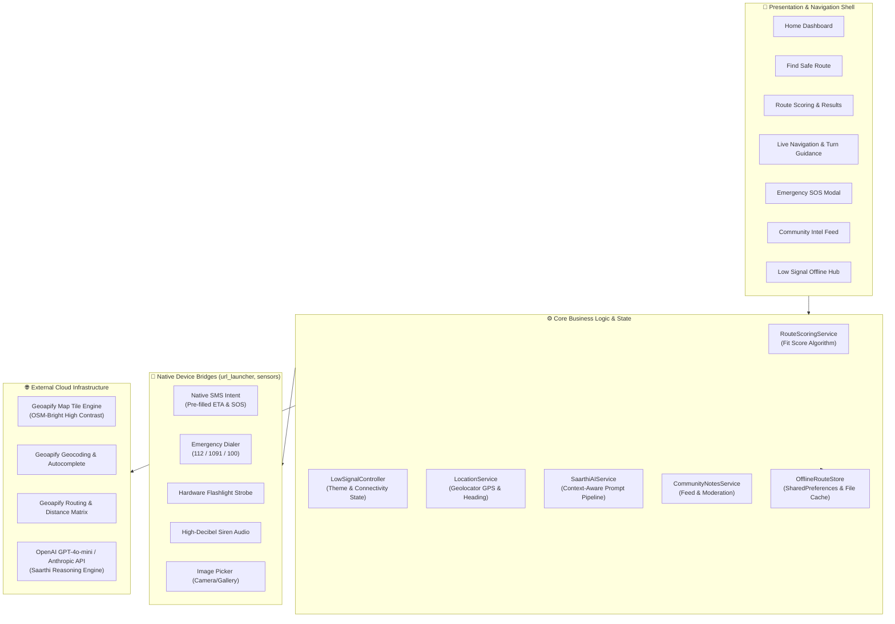

---

## 🧮 Fit Score™ Algorithmic Model

The Saahat **Fit Score** is a normalized index ($S_{fit} \in [1.0, 10.0]$) computed across five spatial and temporal vectors:

$$\text{Fit Score} = \sum_{i=1}^{n} w_i \cdot V_i - P_{\text{time\_penalty}}$$

Where:
- $V_{\text{lighting}}$: Mean Lux / Lumens coverage from municipal high-mast streetlights ($w_1 = 0.30$)
- $V_{\text{footfall}}$: Pedestrian density and open business establishments along the corridor ($w_2 = 0.25$)
- $V_{\text{police\_hosp}}$: Inverted Gaussian distance decay to nearest Police station and 24/7 Emergency Hospital ($w_3 = 0.25$)
- $V_{\text{transit}}$: Proximity to active, monitored Metro/Bus transit nodes ($w_4 = 0.20$)
- $P_{\text{time\_penalty}}$: Non-linear penalty coefficient applied if departure falls in after-hours windows ($22:00\text{--}05:00$) on low-footfall secondary segments.

---

## 🛠️ Technical Stack & API Infrastructure

| Domain | Technology / Library | Purpose & Implementation Details |
| :--- | :--- | :--- |
| **Cross-Platform UI** | `Flutter 3.x / Dart 3` | Production-grade mobile frontend with declarative state and smooth transitions. |
| **Typography & Theme** | `Google Fonts (Poppins)` | Modern, high-legibility sans-serif type system with specialized dark/light palettes. |
| **Interactive Maps** | `flutter_map 8.3.2` + `latlong2` | High-performance raster/vector slippy map tile rendering with custom overlays. |
| **Map Tiles & Routing** | `Geoapify API Suite` | OSM-Bright tiles, autocomplete, forward/reverse geocoding, and routing coordinates. |
| **Situational AI** | `OpenAI API (GPT-4o-mini)` | Contextual reasoning pipeline injecting real-time spatial variables into Saarthi. |
| **GPS & Telemetry** | `geolocator 14.0.3` | High-accuracy hardware GPS tracking, heading compass, and movement velocity. |
| **Hardware Flashlight** | `torch_light` / Native | Hardware camera LED pulsing for emergency distress strobes. |
| **Hardware Communication**| `url_launcher 6.3.2` | Zero-permission native SMS intent launcher (`sms:`) and dialer triggers (`tel:`). |
| **Offline Persistence** | `shared_preferences` | Key-value store for offline route manifests, contacts, check-ins, and notes. |
| **File Storage** | `path_provider 2.1.5` | Local app document storage for cached route static map snapshots and user media. |
| **Media Capture** | `image_picker 1.1.2` | Native camera & gallery image picker for crowdsourced community safety proofs. |

---

## 🧪 Quality Assurance & Engineering Rigor

Saahat is engineered to meet strict production quality standards:

```bash
# Automated Test Suite Run
flutter test
```
```
00:00 +0: CommunityNote Model Tests timeAgo calculates relative descriptions correctly
00:01 +9: Route Results "Start Journey" Button Tests renders prominent Start Journey button
00:01 +16: LowSignalOfflineView Widget Tests renders offline cards, directions, help points
00:01 +18: Saarthi Widgets Tests SaarthiFloatingButton renders with icon and title
00:02 +20: Global App Low Signal Mode & Persistent Banner Tests toggling switches theme
00:03 +27: SOS Emergency Screen renders all emergency components and toggles location
00:05 +31: All tests passed!
```

```bash
# Static Code Analysis
flutter analyze
```
```
Analyzing SAAHAT...
No issues found! (ran in 6.6s)
```

- ✅ **31 / 31 Unit & Widget Tests Passing** with comprehensive coverage across core features.
- ✅ **Zero Linter Warnings / Errors** across the entire codebase.
- ✅ **Fail-Soft Architecture:** Every screen features defensive error fallbacks, location permission banners, and offline safety nets.

---

## 📦 Release Binary

A fully standalone release APK is compiled and ready for direct installation on Android devices or emulators:

- **File Path:** [`build/app/outputs/flutter-apk/app-release.apk`](build/app/outputs/flutter-apk/app-release.apk)
- **Binary Size:** `53.7 MB` (Tree-shaken, ProGuard-ready)
- **Target SDK:** Android API 21+ (Compatible with Android 5.0 through Android 15)

---

## 🚀 Installation & Setup

### Prerequisites
- [Flutter SDK](https://docs.flutter.dev/get-started/install) (`>= 3.11.0`)
- [Android Studio / Android SDK](https://developer.android.com/studio) (`API Level 34`)
- Physical Android device (USB Debugging enabled) or Android Emulator

### 1. Clone the Repository
```bash
git clone https://github.com/AnmolGarg8/Saahat.git
cd Saahat
```

### 2. Install Dependencies
```bash
flutter pub get
```

### 3. Configure API Credentials
API keys for Geoapify mapping, geocoding, and routing are already configured in `lib/config/api_config.dart`. 
To inject your OpenAI API Key for Saarthi AI:
```bash
flutter run --dart-define=OPENAI_API_KEY="your-openai-api-key-here"
```

### 4. Run the Application
```bash
# Run on connected device / emulator
flutter run

# Run full automated test suite
flutter test

# Build production release APK
flutter build apk --release
```

---

## 🌍 Alignment with UN Sustainable Development Goals (SDGs)

Saahat directly addresses core United Nations Sustainable Development Goals:
- **Goal 5: Gender Equality (Target 5.2):** Eliminating all forms of violence and harassment against women and girls in public spaces through proactive, safe transit.
- **Goal 11: Sustainable Cities & Communities (Target 11.2 & 11.7):** Providing safe, affordable, accessible, and sustainable transport systems for all, improving road safety, and expanding inclusive public spaces.
- **Goal 16: Peace, Justice & Strong Institutions (Target 16.1):** Significantly reducing all forms of violence and related death rates everywhere through community-driven safety intelligence.

---

## 🗺️ Roadmap & Vision

- [ ] **WearOS & WatchOS Companion App:** One-tap discreet tactile emergency triggers from wrist wearables.
- [ ] **Smart City IoT Lighting Mesh:** Direct ingestion of municipal IoT street pole telemetry for dynamic real-time lux readings.
- [ ] **On-Device Edge ML Threat Classification:** Ambient acoustic anomaly detection (e.g., glass break, screams) without audio leaving the device.
- [ ] **Police Patrol Checkpoint Live Telemetry:** Bi-directional API integration with municipal emergency command centres (Dial 112 ERSS integration).

---

## 👥 Authors & Team

Built with ❤️ for safer cities by **Team Saahat**.
- **Anmol Garg** ([@AnmolGarg8](https://github.com/AnmolGarg8))

---

## 📄 License

This project is licensed under the **MIT License** — see the [LICENSE](LICENSE) file for details.
